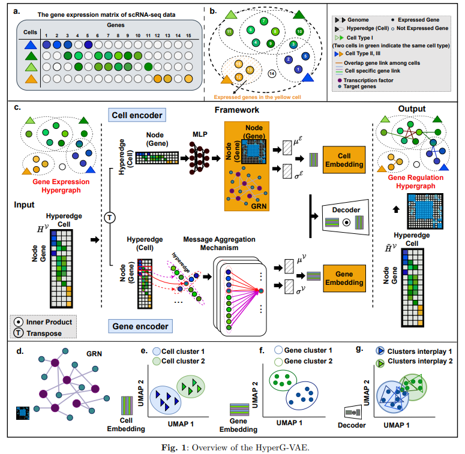

# HyperG-VAE
Code for the paper named ["Inferring gene regulatory networks by hypergraph variational autoencoder"](https://github.com/guangxinsuuu/HyperG-VAE). 

## Abstract
In constructing Gene Regulatory Networks (GRN), it is vital to account for both differential gene module regulation and the diversity stemming from cellular heterogeneity.  Here we present HyperG-VAE, a Bayesian deep generative model that utilizes a hypergraph for analyzing single-cell RNA sequencing (scRNA-seq) data. HyperG-VAE employs a gene encoder with a Structural Equation Model for GRN construction and gene module identification, alongside a cell encoder using hypergraph self-attention for cellular heterogeneity analysis, cohesively optimized by a decoder.
HyperG-VAE excels in GRN inference and scRNA-seq visualization, confirmed by benchmarks. It effectively reveals gene regulation in bone marrow B cell development and shows robustness in varied downstream analyses. The model’s cell encoder identifies distinct cell clusters and maps B cell progression. As another key contribution, gene set enrichment analysis (GSEA) validates the gene encoder's module associations with specific cellular contexts, demonstrating its comprehensive analytical capabilities.

## Requirements
* Pytorch 1.12.1
* Python 3
* CUDA 11.6
* Different environment setting may make very subtle difference

## More code
* EPR and AUPRC calculation tutorial could be found in ["DeepSEM"](https://github.com/HantaoShu/DeepSEM/tree/master/tutorial)
* SCENIC tutorial could be found in ["SCENIC"](https://github.com/aertslab/pySCENIC)
* GSEA analysis tool could be found ["here"](https://metascape.org/gp/index.html#/main/step1)
* Chip-Atlas dataset could be found ["here"](https://chip-atlas.org/target_genes)
* scRNA-seq data with clustering label annotation preprocess tutorial could be found ["here"](https://github.com/hemberg-lab/scRNA.seq.datasets)

